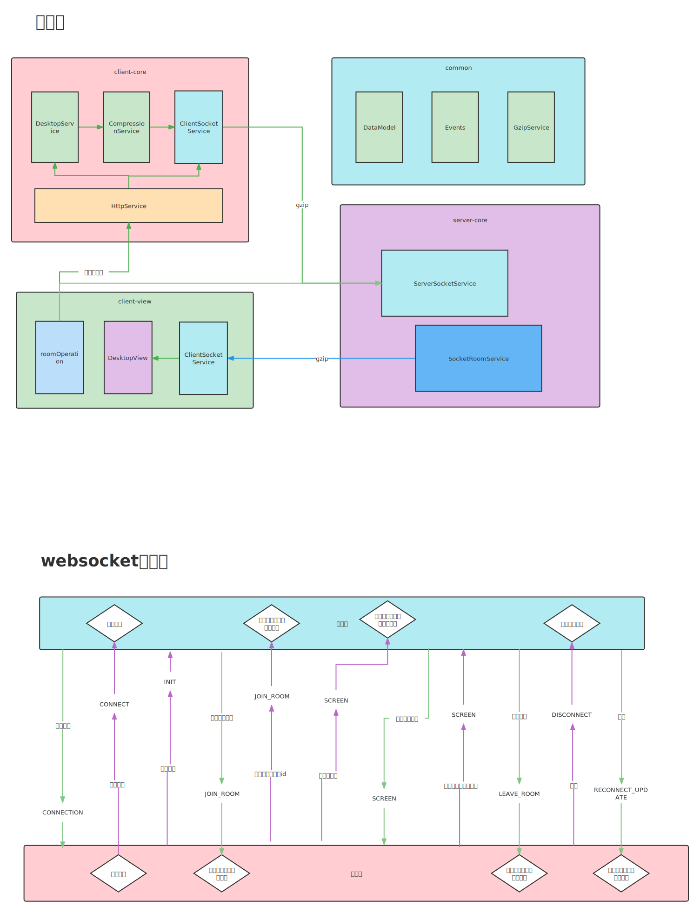

目前为止，有非常多的远程桌面软件可以选择，使用`nodejs`重新开发的目的仅仅是为了学习`nodejs`。
当前的设计实现仅仅是`Demo`，约只有 [rustdesk](https://github.com/rustdesk/rustdesk) `1/10`的效果。

### 一、实现远程桌面必备的要素
* 远程画面获取与传输
* 网络隧道通讯
* 控制协议

### 二、基本思路
- `client`端
    - `client core`：用于实时获取屏幕的画面并进行编码压缩，通过网络传输到`server`端
    - `clenet gui`：用于处理显示`server`端传输过来的屏幕画面
- `server`端：
  - `server core`：处理`client core`的数据并提供`clenet gui`直连数据推送
  - `server gui`：用于管理所有的`client core`与`clenet gui`
  
### 三、需要处理的问题
- 画面捕获（截屏图片、推视频流）
    - 截屏图片的方式具有明显的延迟，在牺牲图片显示画质的情况下可以提升画面流畅度
    - 推视频流的方式流畅度很高，但是需要架设推流服务器
- 画面数据压缩传输
    - 降低传输带宽占用，提升传输能力，也确保数据不被窃取
- 网络通讯
    - 使用`websocket`建立通讯，通过`topic、room`等机制实现数据的收发和触达。
- 画面数据解压缩
    - 需要考虑解压缩的效率问题
- 画面还原，显示到页面上
    - `html web`页面
    - `GUI`页面

### 四、技术架构
#### A、技术栈介绍
- `server`端
    - `nodejs 16.17` 主体语言
    - `typescript 4.7.3` 开发语言
    - `ts-node 10.8.1` 支持`nodejs`下使用`typescript`的支持库
    - `express 4.16.1` 网络支持库
    - `socket.io 4.5.1` `websocket`支持库（依赖于`express`）
- `clenet core`
    - `nodejs 16.17` 主体语言
    - `typescript 4.7.3` 开发语言
    - `ts-node 10.8.1` 支持`nodejs`下使用`typescript`的支持库
    - `express 4.16.1` 网络支持库
    - `socket.io-client 4.5.1` `websocket`支持库（依赖于`express`）
    - `@squoosh/lib 0.4.0` 谷歌出品的图片压缩支持库 (使用请参考 [nodejs之图片压缩](http://blogs.ayouran.com/archives/nodejs%E4%B9%8B%E5%9B%BE%E7%89%87%E5%8E%8B%E7%BC%A9))
    - `screenshot-desktop 1.12.7` 屏幕截图支持库（在`windows`下有文件权限问题请参考 [nodejs截屏](http://blogs.ayouran.com/archives/n-o-d-e-j-s-jie-ping)）

- `clenet gui`
    - `vue3` 主体框架
    - `typescript 4.5.5` 开发语言
    - `socket.io-client 4.5.1` `websocket`支持库
    - `canvas 2.9.3` 画图支持库
- `common`
    - 定义所有的数据模型
    - 定义所有的事件模型
    - 压缩&解压（加解密）工具

#### B、详细设计

#### C、设计缺陷
- 画面获取需要改变由截屏变成推流才有可能接近 [rustdesk](https://github.com/rustdesk/rustdesk) 这种低延时的效果
    - `canvas`的性能不足以支撑`1s`内多个画面帧的绘制
    - 可能的替代方案是`ffmpeg`
- 需要补充设计一套控制模型

说实话，这个`demo`写完让我挺失望的，没什么好写的了，后面替换为推流再整一版，当前项目地址 [rdvc](https://github.com/liuchengts/rdvc)

### 五、使用
- `server core`端
  - `cd rdvc/server/core`
  - `npm install`
  - `npm run build`
  - `npm run pkg`
  - 更多命令参见`package.json`

- `clenet core`端
  - `cd rdvc/clenet/core`
  - 必须更改`src/index.ts`第`24`行，`ip`地址为`server core`端的地址
  - `npm install`
  - `npm run build`
  - `npm run pkg`
  - 更多命令参见`package.json`

- `clenet gui`端
  - `cd rdvc/clenet/gui`
  - 必须更改`src/main.ts`第`20`行，`ip`地址为`server core`端的地址（向服务器注册并推送数据到本地）
  - 可选更改`vue.config.js`第`37`行，`ip`地址为`clenet core`端的地址（主动找客户端拉数据到本地）
  - `npm install`
  - `npm run build`
  - 更多命令参见`package.json`